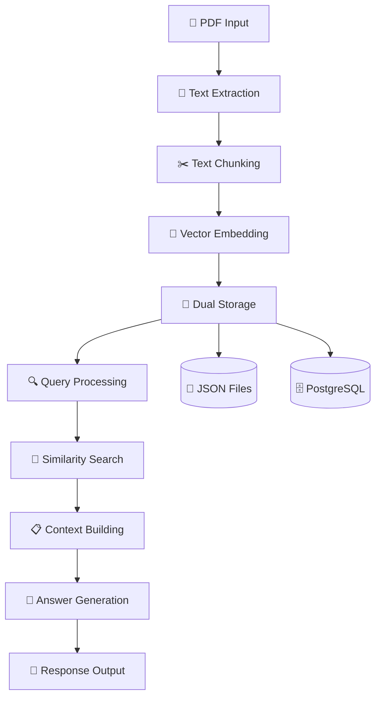

# 🤖 Simple RAG Chatbot

<div align="center">


Chatbot sederhana menggunakan **RAG (Retrieval-Augmented Generation)** dengan Google Gemini API dan PostgreSQL.

[Features](#-fitur) • [Installation](#️-instalasi) • [Usage](#-cara-menggunakan) • [Configuration](#-konfigurasi) • [Architecture](#-arsitektur)

</div>

---

## 🚀 Fitur

| Fitur | Deskripsi |
|-------|-----------|
| 📄 **PDF Processing** | Ekstrak dan proses dokumen PDF secara otomatis |
| 🔍 **RAG Implementation** | Retrieval-Augmented Generation tanpa library kompleks |
| 🤖 **Gemini Integration** | Google Gemini API untuk embedding dan text generation |
| 🗄️ **Dual Storage** | Penyimpanan di JSON files dan PostgreSQL database |
| 🔒 **Environment Security** | Konfigurasi API key yang aman dengan `.env` |
| 📊 **Vector Search** | Pencarian semantic menggunakan cosine similarity |

---

## 📁 Struktur Project

```bash
simple-chatbot/
├── 📁 data/                    # Dokumen PDF input
│   ├── sample.pdf
│   └── indobert_lstm.pdf
├── 📁 chunks/                  # Hasil chunking text
│   └── chunks.json
├── 📁 embeddings/              # Vector embeddings
│   └── embeddings.json
├── 🔧 Core Files
│   ├── chatbot.py              # 🎯 Main application
│   ├── pdf_processor.py        # 📄 PDF reading
│   ├── chunker.py              # ✂️ Text chunking
│   ├── embedder.py             # 🔢 Vector embedding
│   ├── retriever.py            # 🔍 Information retrieval
│   ├── generator.py            # 🤖 Answer generation
│   └── db_config.py            # 🗄️ Database configuration
├── ⚙️ Configuration
│   ├── .env                    # 🔒 Environment variables
│   ├── .env.example            # 📋 Template
│   ├── .gitignore              # 🚫 Git ignore
│   └── requirements.txt        # 📦 Dependencies
└── 📖 Documentation
    └── README.md
```

---

## 🛠️ Instalasi

### Prerequisites
- Python 3.9+
- PostgreSQL 12+
- Git

### Quick Start

1. **Clone Repository**
   ```bash
   git clone https://github.com/yourusername/simple-chatbot.git
   cd simple-chatbot
   ```

2. **Install Dependencies**
   ```bash
   pip install -r requirements.txt
   ```

3. **Setup Environment**
   ```bash
   cp .env.example .env
   # Edit .env dengan API keys Anda
   ```

4. **Setup Database**
   ```sql
   -- Buat database PostgreSQL
   CREATE DATABASE chatbot;
   ```

5. **Get API Key**
   - Kunjungi: [Google AI Studio](https://makersuite.google.com/app/apikey)
   - Generate API key baru
   - Masukkan ke file `.env`

---

## 🎯 Cara Menggunakan

### 1. Preprocessing PDF
```bash
# Proses dokumen PDF menjadi knowledge base
python chatbot.py --preprocess data/your-document.pdf
```

### 2. Start Chat Session
```bash
# Mulai interactive chat
python chatbot.py
```

### 3. Contoh Percakapan
```bash
🤖 SIMPLE RAG CHATBOT

✅ Loaded 67 chunks

💬 CHAT MODE - Type 'quit' to exit

🔍 Question: apa itu LSTM
🤖 Answer: LSTM adalah Long Short-Term Memory, yaitu versi dari 
Recurrent Neural Network (RNN) yang dikembangkan oleh Hochreiter 
& Schmidhuber pada tahun 1997 untuk mengatasi masalah vanishing 
gradient pada RNN tradisional...

🔍 Question: jelaskan metodologi penelitian
🤖 Answer: Metodologi penelitian menggunakan pendekatan kuantitatif 
dengan menganalisis data sentimen menggunakan kombinasi model 
IndoBERT dan LSTM...

🔍 Question: quit
👋 Goodbye!
```

---

## 🔧 Konfigurasi

### Environment Variables (`.env`)

```bash
# 🔑 API Configuration
GEMINI_API_KEY=your-gemini-api-key-here

# 🗄️ Database Configuration  
DB_HOST=localhost
DB_NAME=chatbot
DB_USER=postgres
DB_PASSWORD=your-password
DB_PORT=5432

# ⚙️ Chatbot Settings
CHUNK_SIZE=500
CHUNK_OVERLAP=50
TOP_K_RESULTS=3
EMBEDDING_MODEL=models/text-embedding-004
GENERATION_MODEL=models/gemini-2.5-flash

# 📁 File Paths
EMBEDDINGS_PATH=embeddings/embeddings.json
CHUNKS_PATH=chunks/chunks.json
DATA_PATH=data
```

### Model Support

| Provider | Model | Usage |
|----------|-------|-------|
| **Google Gemini** | `text-embedding-004` | Text embedding |
| **Google Gemini** | `gemini-2.5-flash` | Text generation |

---

## 📦 Dependencies

```bash
# Core Dependencies
PyPDF2==3.0.1              # PDF processing
numpy==1.24.3               # Numerical operations  
google-generativeai==0.8.5  # Gemini API
psycopg2==2.9.11            # PostgreSQL connector
python-dotenv==1.1.1        # Environment variables
requests==2.31.0            # HTTP requests
```

---

## 🏗️ Arsitektur

### RAG Pipeline Flow



### System Architecture

```bash
┌─────────────────┐    ┌──────────────────┐    ┌─────────────────┐
│   📄 PDF Input  │ => │  🔄 Processing   │ => │ 💾 Storage      │
│                 │    │                  │    │                 │
│ • Upload PDF    │    │ • Text Extract   │    │ • JSON Files    │
│ • Validate      │    │ • Chunking       │    │ • PostgreSQL    │
│ • Queue         │    │ • Embedding      │    │ • Vector Index  │
└─────────────────┘    └──────────────────┘    └─────────────────┘
                                  │
┌─────────────────┐    ┌──────────────────┐    ┌─────────────────┐
│ 💬 Chat Output  │ <= │  🤖 Generation   │ <= │ 🔍 Retrieval    │
│                 │    │                  │    │                 │
│ • Format Answer │    │ • Context Build  │    │ • Query Embed   │
│ • Stream Text   │    │ • Gemini API     │    │ • Similarity    │
│ • Error Handle  │    │ • Post Process   │    │ • Rank Results  │
└─────────────────┘    └──────────────────┘    └─────────────────┘
```

---

## 🚦 Alur Proses

| Step | Process | Input | Output | Duration |
|------|---------|-------|--------|----------|
| 1 | **PDF Processing** | `document.pdf` | Raw text | ~2s |
| 2 | **Text Chunking** | Raw text | 67 chunks | ~1s |
| 3 | **Vector Embedding** | Text chunks | 768-dim vectors | ~30s |
| 4 | **Storage** | Embedded chunks | JSON + PostgreSQL | ~5s |
| 5 | **Query Processing** | User question | Query vector | ~2s |
| 6 | **Similarity Search** | Query + Knowledge | Top-3 chunks | ~1s |
| 7 | **Answer Generation** | Question + Context | Final answer | ~3s |

**Total Processing Time: ~44 seconds for initial setup, ~6 seconds per query**

---

## 🔒 Security Features

| Feature | Implementation | Purpose |
|---------|----------------|---------|
| **Environment Variables** | `.env` file | Secure API key storage |
| **Git Security** | `.gitignore` patterns | Prevent sensitive file commits |
| **Template Configuration** | `.env.example` | Safe setup guide |
| **Error Handling** | Try-catch blocks | Graceful failure handling |
| **Input Validation** | File existence checks | Prevent malicious inputs |

---

## 🐛 Troubleshooting

<details>
<summary><strong>❌ API Key Issues</strong></summary>

```bash
# Error: GEMINI_API_KEY not found
Solution:
1. Check .env file exists
2. Verify API key format: GEMINI_API_KEY=AIzaSy...
3. Restart application
```
</details>

<details>
<summary><strong>🗄️ Database Connection</strong></summary>

```bash
# Error: Database connection failed
Solution:
1. Check PostgreSQL is running
2. Verify database exists: CREATE DATABASE chatbot;
3. Check credentials in .env file
4. Test: python db_config.py
```
</details>

<details>
<summary><strong>📄 PDF Processing</strong></summary>

```bash
# Error: PDF tidak bisa dibaca
Solution:
1. Check file exists in data/ folder
2. Verify PDF is not corrupted
3. Try different PDF file
4. Check file permissions
```
</details>

<details>
<summary><strong>🔧 Module Import</strong></summary>

```bash
# Error: ModuleNotFoundError
Solution:
pip install -r requirements.txt
# Or install individually:
pip install PyPDF2 google-generativeai psycopg2 python-dotenv numpy
```
</details>

---

## 📊 Performance Metrics

| Metric | Value | Notes |
|--------|-------|-------|
| **Embedding Dimension** | 768 | Google Gemini text-embedding-004 |
| **Chunk Size** | 500 characters | Configurable via `.env` |
| **Chunk Overlap** | 50 characters | For context preservation |
| **Retrieval Top-K** | 3 chunks | Best balance accuracy/speed |
| **Response Time** | ~6 seconds | Average per query |
| **Memory Usage** | ~200MB | For 67 chunks in memory |

---

## 🤝 Contributing

1. **Fork the repository**
2. **Create feature branch**: `git checkout -b feature/amazing-feature`
3. **Commit changes**: `git commit -m 'Add amazing feature'`
4. **Push to branch**: `git push origin feature/amazing-feature`  
5. **Open Pull Request**

---

## 📝 License

This project is licensed under the MIT License - see the [LICENSE](LICENSE) file for details.

---

## 🙏 Acknowledgments

- [Google Gemini API](https://ai.google.dev/) for powerful AI capabilities
- [PostgreSQL](https://www.postgresql.org/) for robust data storage
- [PyPDF2](https://pypdf2.readthedocs.io/) for PDF processing
- RAG methodology for enhanced AI responses

---

<div align="center">

**Made with ❤️ for educational purposes**

[⭐ Star this repo](../../stargazers) • [🐛 Report Bug](../../issues) • [💡 Request Feature](../../issues)

</div>
